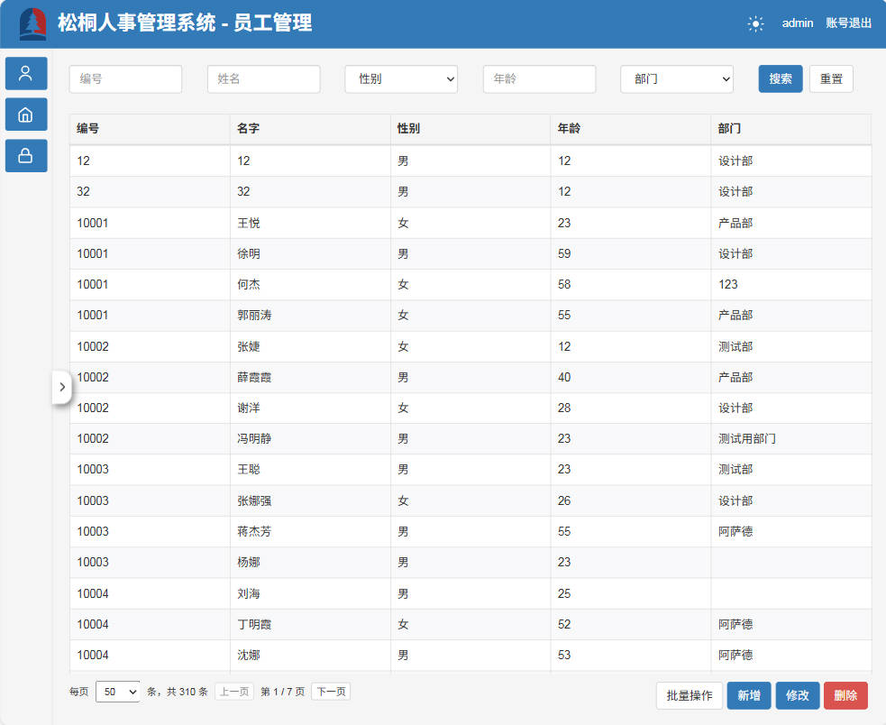
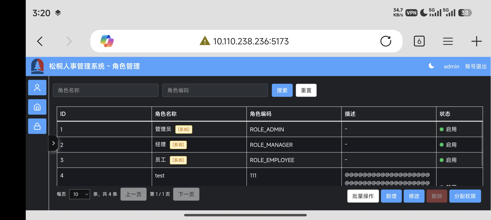
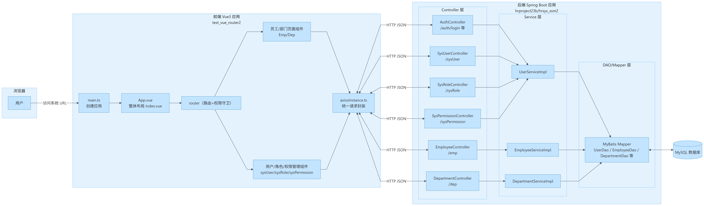

## 项目简介

本项目是一个 **松桐人事管理系统**（前后端分离，全栈示例），包含典型的人事/权限场景：

<p float="left">
  
   
</p>

- 用户管理（账号、状态、角色分配）
- 角色管理（角色、权限分配，系统内置角色保护）
- 权限管理（基础权限 CRUD，系统内置权限保护）
- 部门管理
- 员工管理
- 登录认证、权限控制
- 亮/暗主题切换
- 桌面端优先布局 + 简单的移动端适配（横屏 + 缩放）
- 通用表格组件（固定表头、滚动体、分页、批量操作）
- 通用表单校验、通用 Loading 遮罩、通用搜索重置等

仓库布局（关键目录）：

- **前端**：`test_vue_router2/`（Vite + Vue 3 + TypeScript）
- **后端**：`hrproject23b/hrsys_ssm2/`（Spring Boot + MyBatis + MySQL）

<p float="left">
  
</p>

---

## 技术栈

### 前端

- **框架**：Vue 3 + Composition API
- **语言**：TypeScript
- **构建工具**：Vite
- **UI 技术**：
  - 自定义布局 + Bootstrap 风格按钮、表格
  - 通用表格头组件 `BaseTableHeader`
  - Loading 遮罩组件 `BaseLoadingOverlay`
  - 暗黑 / 亮色主题（CSS 变量）
  - 简单移动端适配（横屏 + 缩放）

### 后端

- **框架**：Spring Boot
- **持久层**：MyBatis
- **数据库**：MySQL（示例使用数据库名 `hrsys1`）
- **构建**：Maven
- **安全 & 其他**：
  - BCrypt 密码加密
  - 全局 CORS 配置
  - 统一返回结果 `Result<T>`

---

## 功能概览

### 登录认证

- 账号密码登录，密码使用 BCrypt 加密存储。
- 登录成功后前端保存会话信息，用于后续接口访问。

### 用户管理

- 列表字段：
  - **ID**、**用户名**、**姓名**、**邮箱**、**状态**（启用/禁用）、**已分配角色**
  - 状态列前有颜色小圆点（绿 = 启用，灰 = 禁用，样式可复用）
- 查询：
  - 支持按“用户名”“姓名”搜索
  - 搜索重置按钮：一键清空所有筛选条件
- 分页：
  - 每页条数可选：10 / 20 / 50 / 100
  - 每个页面的 pageSize 会持久化到 localStorage，返回页面后自动恢复
- 批量操作：
  - “批量操作”开关切换单选 / 多选模式
  - 批量模式下仅支持 **批量删除**，禁止批量编辑
  - 全选复选框居中，交互一致
- 单条编辑：
  - 弹窗修改：用户名、姓名、邮箱、状态、密码
  - 使用 `useFormValidation` 中的用户表单校验
  - 密码为空则保持原密码，非空则重新加密
- 体验细节：
  - 所有主要按钮使用 `v-auto-blur` 指令，点击后自动失焦，避免按钮长时间灰态
  - 提供明显的 hover / pressed 效果

### 角色管理

- 列表字段：ID、角色名称、角色编码、描述、状态
- 角色-权限分配：
  - “分配权限”弹窗，勾选/取消一个角色拥有的权限
  - 保存时使用统一 API 更新角色的权限列表
- 系统内置角色（与权限系统逻辑复用）：
  - 默认将前三条角色 **“管理员、经理、员工”** 视作系统角色：
    - 只能修改「描述」「启用/禁用」
    - 名称、编码锁定为只读
    - 不可删除（前端删除按钮禁用 + 后端校验拒绝）
    - 在列表角色名称后显示 `[系统]` 徽章
  - 系统角色判定逻辑复用：
    - `id <= 3` 或 `name` 属于 `["管理员","经理","员工"]`
- 其他角色：
  - 支持完整 CRUD 和权限分配

### 权限管理

- 列表字段：ID、权限名称、编码、描述、状态
- 批量操作：
  - 与用户、角色页面一致：开关切换 “单选 / 多选”
  - 批量模式仅支持批量删除
- 系统内置权限（与角色保护逻辑复用）：
  - 通过 **ID 范围 + 编码常量** 组合判定：
    - ID 在 1–6 之间，或
    - `code` 在 `SYSTEM_PERMISSION_CODES` 中
  - 对系统权限的限制：
    - 只能修改「描述」「启用/禁用」
    - 名称、编码锁定不可改
    - 不可删除（前端禁用按钮 + 后端 `deletePermission` 再校验）
    - 列表权限名称后显示 `[系统]` 徽章

### 部门管理

- 列表字段：ID、部门编号、部门名称、描述、状态等
- 查询：
  - 可按“部门名称”“部门编号”搜索，并支持对调搜索项顺序
  - 搜索重置按钮：使用 `useSearchReset` 完成
- 分页与表格：
  - 使用 `usePagination` 实现分页
  - 使用 `BaseTableHeader + useSyncTableHeader` 实现表头固定、列宽同步
  - 表体滚动不带动表头，滚动条宽度有补偿，避免错位
- 批量操作：
  - 模式同用户/角色/权限页面，仅支持批量删除
- 表单校验（新增/修改复用）：
  - 部门编号：必填，大于 0 的数字
  - 部门名称：必填，不可为空字符串

### 员工管理

- 列表字段：编号、姓名、性别、年龄、部门、描述、状态等
- 查询：
  - 支持多条件搜索
  - 重置按钮清空搜索条件
- 批量操作：
  - 模式同其他列表，仅支持批量删除
- 关联逻辑：
  - 员工所属部门从后端加载下拉列表
  - 删除员工时有成功/失败反馈
- 表单校验（新增/修改复用）：
  - 编号：必填，大于 0 的数字
  - 姓名：必填
  - 性别：必选
  - 年龄：1–120 数字
  - 部门：必选

### 通用表格 & 交互能力

- `usePagination`：统一分页逻辑
  - 支持本地存储每页条数（按页面维度区分 Key）
- `useSearchReset`：搜索条件重置
- `BaseTableHeader` + `useSyncTableHeader`：
  - Header 单独渲染且固定
  - Body 滚动时列宽与 Header 同步，解决滚动条占宽导致的错位
- `BaseLoadingOverlay`：
  - 表格、表单访问后端接口时显示半透明蒙层与 Loading 动画
  - 员工页面实现了“并发请求计数”逻辑，只要有请求在路上就显示 Loading
- `useClickOutsideClearSelection`：
  - 点击表格外区域自动取消选中，批量/单选均生效
- `v-auto-blur` 指令：
  - 按钮点击后延时自动 `blur()`，避免长时间处于 focus 态导致样式怪异

### 主题 & 样式

- 亮/暗主题切换：
  - 顶栏使用太阳/月亮图标作为开关
  - 主题状态持久化到 localStorage
  - 使用 CSS 变量定义主色、背景色、文字色等
- 暗色模式适配点：
  - 右侧工作区背景改为黑色
  - 表格/表单文字改为浅色
  - 行交替背景与 Hover 颜色重新设计，保证对比度
  - 侧边栏控制按钮、分页下拉、预览窗口、登录页等均有暗色专用样式
- 通用状态 / 阴影：
  - 状态小圆点颜色统一管理（启用/禁用）
  - 侧边栏折叠按钮在亮/暗模式下使用不同阴影（黑/白），且阴影偏向右下

---

## 本地开发环境

### 环境要求

- **Node.js** ≥ 16
- **npm** 或 **pnpm**
- **JDK** 17
- **Maven** ≥ 3.6
- **MySQL** 5.7+/8.0+

### 数据库准备

1. 创建数据库（示例）：

```sql
CREATE DATABASE hrsys1 DEFAULT CHARACTER SET utf8mb4 COLLATE utf8mb4_general_ci;
```

2. 导入数据库结构和基础数据（如已有 `schema.sql` / 初始化脚本请直接执行）。

3. 修改后端数据库配置：`hrproject23b/hrsys_ssm2/src/main/resources/application.properties`

```properties
spring.datasource.url=jdbc:mysql://localhost:3306/hrsys1?serverTimezone=UTC&characterEncoding=UTF-8
spring.datasource.username=root
spring.datasource.password=123456
```

### 启动后端

```bash
cd hrproject23b/hrsys_ssm2

# 开发模式运行
mvn spring-boot:run

# 或打包成 jar
mvn clean package -DskipTests
java -jar target/hrproject23B-0.0.1-SNAPSHOT.jar
```

默认地址：`http://localhost:8013`

### 启动前端

```bash
cd test_vue_router2

npm install
npm run dev
```

默认前端地址：`http://localhost:5173`

#### 前端 API 地址说明

前端通过 `src/util/axiosInstance.ts` 自动判断环境：

- 本地开发（端口 5173）：
  - 直接请求 `http://localhost:8013` 后端
- 生产环境（Nginx + HTTPS）：
  - 前端请求同域 `/api/**`
  - 由 Nginx 将 `/api/` 反向代理到后端 `http://127.0.0.1:8013/`

如需修改可直接调整 `getApiBaseURL()`。

---

## 构建与部署（简要）

### 前端打包

```bash
cd test_vue_router2
npm run build
```

生成的 `dist/` 目录即为可部署的静态资源。

Nginx 配置关键点（示意）：

```nginx
# 前端静态资源 & Vue Router History 模式
location / {
    root /path/to/dist;
    try_files $uri $uri/ /index.html;
}

# API 反向代理
location ^~ /api/ {
    proxy_pass http://127.0.0.1:8013/;
}
```

### 后端部署

后端通过 `java -jar` 启动，或配置成 systemd/service 常驻进程：

```bash
java -Xmx1024M -Xms256M -jar hrproject23B-0.0.1-SNAPSHOT.jar
```

---

## 代码结构（前端）

只列核心文件，方便查阅：

- `src/main.ts`：应用入口，注册主题、路由、全局指令
- `src/router/index.ts`：路由配置 & 登录守卫
- `src/api/*.ts`：各业务模块 HTTP API 封装
- `src/types/user.ts`：用户/角色/权限等 TypeScript 类型定义
- `src/constants/colors.ts`：亮/暗主题颜色
- `src/util/axiosInstance.ts`：Axios 实例与 baseURL 逻辑
- `src/util/usePagination.ts`：分页 Hook
- `src/util/useFormValidation.ts`：部门、员工、用户等表单校验
- `src/util/useSyncTableHeader.ts`：表头列宽同步
- `src/util/useSearchReset.ts`：搜索重置
- `src/util/useClickOutsideClearSelection.ts`：点击外部清空选中
- `src/components/common/BaseTableHeader.vue`：通用表头组件
- `src/components/common/BaseLoadingOverlay.vue`：通用 Loading 遮罩
- 业务页面：
  - `src/components/sysUser/Show.vue`
  - `src/components/sysRole/Show.vue`
  - `src/components/sysPermission/Show.vue`
  - `src/components/department/Show.vue`
  - `src/components/employee/Show.vue`

---

## 代码结构（后端）

- `com.lz08.hrsys_ssm2`
  - `controller`
    - `SysUserController`：用户管理接口
    - `SysRoleController`：角色管理接口
    - `SysPermissionController`：权限管理接口
  - `service` / `service.impl`：对应业务逻辑实现
  - `dao`：`UserDao`（封装用户/角色/权限相关 SQL 调用）
  - `entity`：`User`、`Role`、`Permission` 等实体类
  - `config`：
    - `CorsConfig`：全局 CORS 配置
  - `common`：
    - `Result<T>`：统一响应封装
- `resources/mapper/UserDao.xml`：MyBatis 核心 SQL（用户、角色、权限及关联表）

---

## 业务规则与注意事项

- **系统权限**：
  - 前 6 条（按 ID + 编码识别）为系统权限：
    - 仅允许修改「描述」「状态」
    - 不可删除
    - 名称与编码锁定不可改
- **系统角色**：
  - “管理员 / 经理 / 员工” 视为系统角色：
    - 仅允许修改「描述」「状态」
    - 不可删除
    - 名称与编码锁定不可改
- **批量操作**：
  - 所有表格的批量操作模式仅支持 **批量删除**，不支持批量编辑
- **表单校验**：
  - 部门、员工、用户等页面的新增与修改统一走 `useFormValidation.ts`，建议新页面沿用这套方式

---

## 后续可扩展方向

- 接入真正的登录会话 & 权限控制（基于 Spring Security / JWT）
- 为操作增加审计日志：记录谁在什么时间做了什么修改
- 增加导入/导出功能（Excel/CSV）
- 引入 UI 组件库（如 Element Plus）重构部分表单与表格，进一步统一风格


